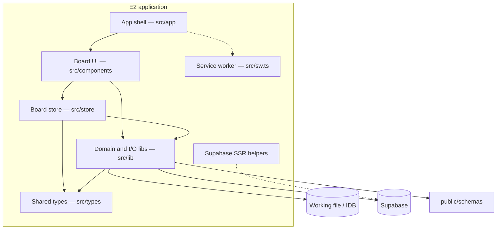
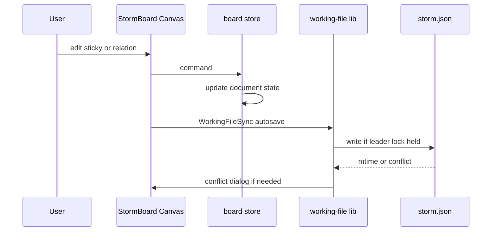

# 5. Building Block View

Evidence sources: [`src/app/`](../../src/app/), [`src/components/`](../../src/components/), [`src/lib/`](../../src/lib/), [`src/store/`](../../src/store/), [`src/types/`](../../src/types/), [`src/utils/supabase/`](../../src/utils/supabase/), [`src/sw.ts`](../../src/sw.ts), [`public/schemas/`](../../public/schemas/).

Related: [context.md](context.md) · [cross-cutting.md](cross-cutting.md) · [deployment.md](deployment.md) · [entry-point.md](../entry-point.md)

## 5.1 Level 1 — Whitebox overall system

The deployed system is a **Next.js client application**. The home route mounts a single composition root; domain state lives in a Zustand store; persistence and collab are libraries invoked from UI sync components.

| Building block | Path | Responsibility |
|----------------|------|----------------|
| App shell | `src/app/` | Layout, home page → `StormBoard`, PWA manifest, offline route |
| Board UI | `src/components/` | Canvas, chrome, panels, dialogs (~44 React modules) |
| Board store | `src/store/storm-board-store.ts` | Zustand document state + editing commands |
| Domain & I/O | `src/lib/` | JSON model, working file, export, geometry, facilitator, collab |
| Types | `src/types/` | Elements, relations, annotations, FS Access typings |
| Supabase SSR utils | `src/utils/supabase/` | Browser/server clients; middleware session helper |
| Service worker | `src/sw.ts` | Serwist precache / offline fallback (build → `public/sw.js`) |

**Contained external contracts** (not code modules): [`public/schemas/`](../../public/schemas/), [`supabase/schema.sql`](../../supabase/schema.sql) — see [context.md](context.md).

## 5.2 Level 2 — Important blackboxes

### App shell

| Interface | Detail |
|-----------|--------|
| Entry | `page.tsx` renders `<StormBoard />` full viewport |
| Layout | `layout.tsx`, `globals.css` |
| Offline | `~offline/page.tsx` + manifest `force-static` |

### Board UI (`StormBoard` composition root)

`storm-board.tsx` wires chrome, canvas, persistence sync, and collab dialogs.

| Cluster | Examples | Role |
|---------|----------|------|
| Canvas core | `storm-canvas`, `storm-element-card`, `storm-connectors`, layers (swimlane, BC), `canvas-lines` | Interactive board surface |
| Chrome / navigation | `board-app-bar`, `board-side-rail`, `board-view-tabs`, `element-palette`, mobile bars/sheets | Mode, views, tools |
| Persistence UX | `working-file-sync`, `data-storage-panel`, `working-file-setup-dialog`, `file-conflict-dialog`, `board-backup-sync` | Attach/save/conflict/backup |
| Collab UX | `collab-room-dialog`, presence banner, enter/leave/sync-conflict dialogs | Optional multi-user |
| Facilitation / info | `facilitator-panel`, `help-dialog`, glossary/hotspot/action-item panels | Workshop support |

### Board store

| Interface | Detail |
|-----------|--------|
| Tech | Single Zustand store (`storm-board-store.ts`, large command surface) |
| Depends on | `lib/storm-json` (normalize document), views, clipboard, z-order, region containment, BC/building-block drill-down helpers |
| Consumed by | Nearly all board components via store hooks/selectors |

### Domain & I/O libraries (`src/lib`)

| Subsystem | Key modules | Responsibility |
|-----------|-------------|----------------|
| Document model | `storm-json`, `board-views`, `file-board-reconcile` | Snapshot v1/v2, views, apply/reconcile to store |
| Working file | `working-file`, `working-file-writer`, `working-file-tab-context`, `working-file-safety` | FS Access, IDB handles, locks, tab slots |
| Backup | `board-backup` | Interval/manual backup downloads + IDB list |
| Export / import | `storm-export`, `view-export`, `diagram-io`, `mermaid-diagram`, `plantuml-diagram`, `ai-board-context-import`, `board-import-text` | Reports, diagrams, paste/import |
| Canvas semantics | `relation-validation`, `region-containment`, `element-*`, `selection-*`, `connector-geometry` | Placement, relations, regions |
| Facilitator | `facilitator-phases`, `storm-help` | Phase catalogues and help copy |
| Collaboration | `lib/collab/*` | See next subsection |

### Collaboration package (`src/lib/collab`)

| Module | Responsibility |
|--------|----------------|
| `config` | Env/localStorage Supabase connection, room constants, host-token helpers |
| `supabase` / `rooms` | Client + anon session; create/join room; CAS snapshot I/O |
| `yjs-board` | Map board ↔ Y.Doc |
| `supabase-yjs-provider` | Realtime Broadcast transport + awareness |
| `session` | Join lifecycle, persist/pull, conflict policy, presence |
| `tab-writer` | Web Lock single writer among collab tabs |
| `file-guard` / `pre-collab-stash` | Enter/create guards; restore on leave |

### Types & Supabase utils

- **Types:** `storm-element`, `storm-relation`, `canvas-annotation`, `action-item`, FS Access `.d.ts`
- **Utils:** thin `@supabase/ssr` wrappers used by middleware / optional server paths — not the collab business logic

## 5.3 Level 2 — Internal relationships (edit / save path)

Collab path (when configured): Store ↔ `yjs-board` ↔ `SupabaseYjsProvider` / `session` ↔ Supabase; parallel mirror via working-file — see [cross-cutting.md](cross-cutting.md) and [context.md](context.md).

## 5.4 Open blackboxes (not further decomposed here)

| Module | Note |
|--------|------|
| Individual canvas interaction handlers inside `storm-canvas` | Large UI; behavior covered by README + tests under `lib/*.test.ts` |
| Export formatters inside `storm-export` | Many report kinds; contract is README Export table + schemas |
| Full Zustand action catalogue | Prefer reading store + tests when changing behavior |

## 5.5 DOC_FOCUS — implementation

This chapter closes the **implementation** focus for the current Build pass: source map at entry-point, static decomposition here, persistence/security/deploy/interfaces in sibling chapters.

## Related next chapters

- Runtime View — solo vs collab sequences in more depth
- Solution Strategy — local-first + optional Yjs/Supabase rationale
- Constraints — Next/static-export and browser API constraints
