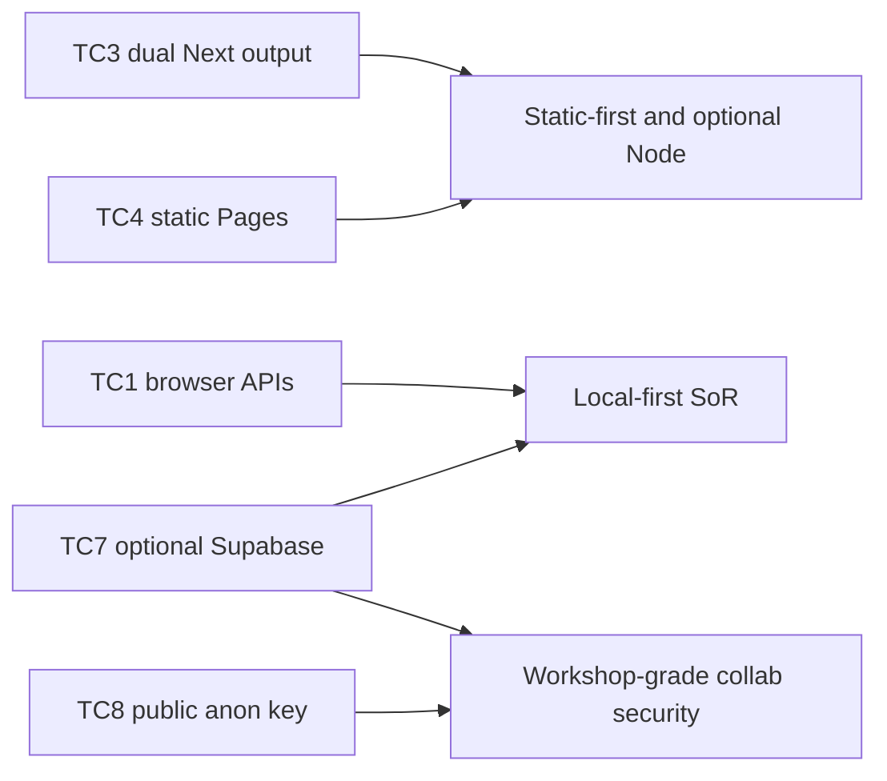

# 2. Architecture Constraints

Evidence sources: [`package.json`](../../package.json), [`next.config.ts`](../../next.config.ts), [`middleware.ts`](../../middleware.ts), [`LICENSE`](../../LICENSE), [`README.md`](../../README.md), [`.gitignore`](../../.gitignore), [deployment.md](deployment.md), [cross-cutting.md](cross-cutting.md), [solution-strategy.md](solution-strategy.md).

Related: [introduction.md](introduction.md) · [solution-strategy.md](solution-strategy.md)

Constraints below are **binding limits visible in the repo or product stance** — not wish-list preferences.

## 2.1 Technical constraints

| ID | Constraint | Implication |
|----|------------|-------------|
| TC1 | **Browser client** as the execution environment for modeling | No native desktop shell; capabilities depend on browser APIs (FS Access, IndexedDB, Web Locks, Service Worker) |
| TC2 | **File System Access** “where available” | Fallback paths (open/paste, mobile IDB copy) required; not all browsers expose the same handle UX |
| TC3 | **Next.js dual output** — static `export` vs `standalone` | Features that need Node middleware (Supabase cookie refresh) **do not run on GitHub Pages** |
| TC4 | **Static export limits** | No Next server routes in Pages deploy; `/api/*` treated as network-only in SW; images unoptimized; `trailingSlash` + `basePath` for project Pages |
| TC5 | **Serwist disabled in development** | PWA/offline behavior must be validated via production/static builds |
| TC6 | **Generated service worker not source-of-truth in Git** | `public/sw.js` (and related) gitignored — produced by build |
| TC7 | **Optional Supabase** for collab only | Solo path must work with zero backend; collab requires operator- or user-supplied project + `schema.sql` |
| TC8 | **Client-side publishable/anon key** | No service-role key in the app; security model is workshop-grade (RLS + room code), not private multi-tenant SaaS |
| TC9 | **Yjs over Supabase Realtime** | Live sync depends on Realtime availability; durable path uses CAS snapshots + poll fallback |
| TC10 | **Board format Beta** | `.storm.json` may change incompatibly; consumers must tolerate migration / version field |

## 2.2 Organizational constraints

| ID | Constraint | Implication |
|----|------------|-------------|
| OC1 | **MIT license** (© Andreas Bergmann) | Open redistribution; no warranty — see `LICENSE` |
| OC2 | **Single public product surface** on GitHub Pages (`abx-git.github.io/E2`) | Deploy path optimized for Actions → Pages; custom basePath via repo variable when needed |
| OC3 | **Operator brings Supabase** | E2 does not provision cloud projects; SQL and env docs are the contract |
| OC4 | **Documentation via AGM / arc42 under `docs/`** | Architecture facts live in evidence-based chapters; do not invent empty stubs |
| OC5 | **German product README, English architecture stubs** | Feature truth often in README (DE); architecture chapters cite it without translating the whole product doc |

## 2.3 Conventions

| ID | Convention | Evidence |
|----|------------|----------|
| CC1 | Working file name pattern `*.storm.json` (default `board.storm.json`) | `working-file.ts`, README |
| CC2 | Snapshot `format: "event-storming-tool"` + numeric `version` | Schemas / `storm-json` |
| CC3 | Schemas published under `public/schemas/` (served with the static site) | Repo layout |
| CC4 | Collab room codes: fixed length, unambiguous alphabet | `ROOM_CODE_LENGTH`, `generateRoomCode` |
| CC5 | Env names `NEXT_PUBLIC_SUPABASE_*` (publishable key; legacy anon alias) | `.env.example` |
| CC6 | Sticky method colors treated as methodologically fixed | README Darstellung |
| CC7 | Soft validation preferred for some method rules | README soft-validation notes |

## 2.4 Constraints → architecture impact

## Related next chapters

- Risks — beta format breakage, browser capability gaps, residual collab risks, observability
- Decisions — formal ADRs only when a constraint trade-off needs a dated decision record
- Quality Requirements — measurable refinement of [introduction.md](introduction.md) §1.2
