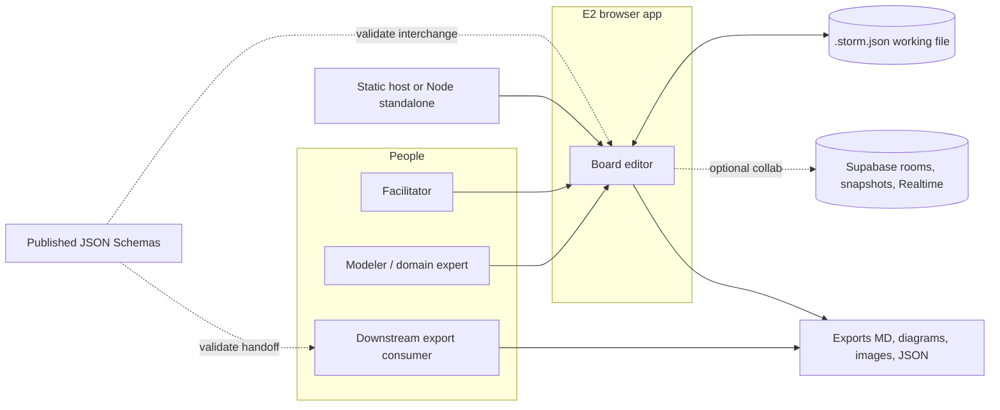
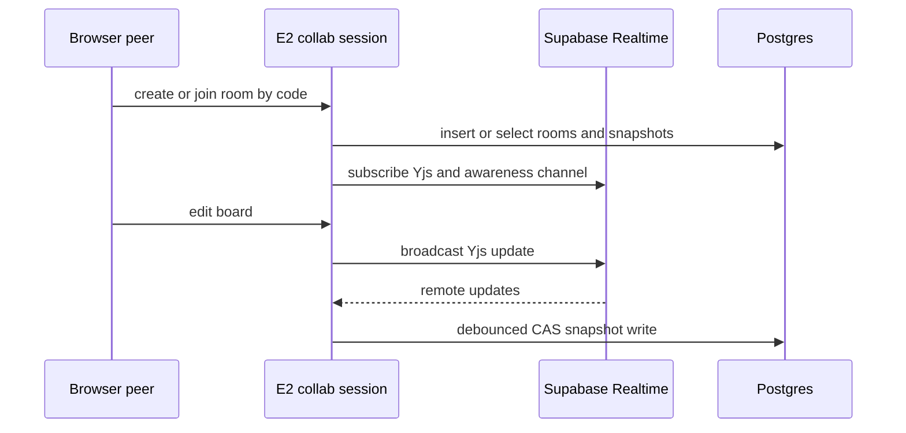

# 3. Context and Scope

Evidence sources: [`README.md`](../../README.md), [`src/lib/collab/`](../../src/lib/collab/), [`src/lib/working-file.ts`](../../src/lib/working-file.ts), [`public/schemas/`](../../public/schemas/), [`supabase/schema.sql`](../../supabase/schema.sql), [`next.config.ts`](../../next.config.ts), [`.github/workflows/deploy-github-pages.yml`](../../.github/workflows/deploy-github-pages.yml).

Related: [introduction.md](introduction.md) · [entry-point.md](../entry-point.md)

## 3.1 Business context

E2 is a **workshop modeling tool** used by facilitators and domain experts. The system of interest is the browser app; domain board data is owned by the user as a local working file. Optional multi-user sessions use an external Supabase project.

| Neighbor | Relationship |
|----------|----------------|
| Facilitator / modeler | Primary operators of the board UI |
| Downstream engineer / BA | Consumes exports and schema-valid JSON; does not require live app access |
| Working file (`.storm.json`) | System of record for solo (and mirrored during collab) board state |
| Supabase (optional) | Room registry, durable snapshot + Yjs state, Realtime Broadcast for live peers |
| Static / Node host | Serves the SPA/PWA; does not store domain boards |

## 3.2 Technical context — external interfaces

### I1 — Local working file (primary persistence)

| Aspect | Detail |
|--------|--------|
| Protocol / API | File System Access API (`showOpenFilePicker` / `showSaveFilePicker`) where available; fallback open/paste; IndexedDB stores file handles and mobile working copies (`e2-working-file`) |
| Format | `format: "event-storming-tool"`, `version: 2`, multi-view `views[]`; v1 migrated on import |
| Contract | [`public/schemas/board-snapshot-v2.schema.json`](../../public/schemas/board-snapshot-v2.schema.json) (v1 schema retained for migration) |
| Coordination | Web Locks (`navigator.locks`) for single-writer across tabs (`working-file-writer`, collab `tab-writer`) |
| Backups | Optional timestamped copies; IndexedDB `e2-board-backups` for local backup metadata/blobs |

### I2 — Published schemas & interchange

| Artifact | Path / role |
|----------|-------------|
| Board snapshot v2 | `public/schemas/board-snapshot-v2.schema.json` — full board import/export |
| Board snapshot v1 | `public/schemas/board-snapshot-v1.schema.json` — legacy |
| AI board context v1 | `public/schemas/ai-board-context-v1.schema.json` — reduced semantic view + import with auto-layout |
| Diagram / report exports | Blob downloads via `URL.createObjectURL` (Mermaid, PlantUML, Markdown reports, SVG/PNG) — see README Export table |

No server-side API for these formats; the browser produces and consumes files.

### I3 — Supabase collaboration (optional)

Active only when URL + publishable/anon key are available (**env wins**, else `localStorage` key `e2-supabase-connection`).

| Interface | Evidence |
|-----------|----------|
| Auth | Anonymous sign-in (`ensureAnonSession`); middleware refreshes session cookies on **Node** hosting only (not on static GitHub Pages) |
| Postgres tables | `rooms` (code, host_token_hash, TTL 14 days), `board_snapshots` (jsonb snapshot, optional `yjs_state`, revision) |
| Access control | RLS policies for `anon` / `authenticated` on non-expired rooms (`supabase/schema.sql`) |
| Live sync | Yjs doc + awareness over Supabase Realtime Broadcast (`SupabaseYjsProvider`); snapshot debounce ~700 ms; poll fallback ~1500 ms |
| Host identity | Host token generated client-side, stored hashed in DB; raw token in `localStorage` (`e2-collab-host-token`) |

### I4 — Hosting & PWA shell

| Mode | Interface |
|------|-----------|
| Static export | `E2_BUILD_TARGET=static` → `out/`; GitHub Actions uploads Pages artifact; `NEXT_PUBLIC_BASE_PATH` (default `/E2`) |
| Standalone | Next `output: "standalone"` for Node; middleware can refresh Supabase auth cookies |
| PWA | Serwist service worker (`src/sw.ts` → `public/sw.js`); precache + document fallback to `~offline`; `/api/*` network-only (no first-party domain API in static mode) |

### I5 — Browser platform services

| Service | Use |
|---------|-----|
| `localStorage` | Supabase connection (static), host token, display name |
| IndexedDB | Working-file handles, mobile copy, local backups |
| Web Locks | Cross-tab writer exclusivity |
| Clipboard / download | Paste JSON; export blobs |
| crypto.subtle | SHA-256 host-token hash before store |

## 3.3 Scope and boundaries

**In scope for the system of interest**

- Interactive board editing, multi-method catalogues, facilitator UX
- Local working-file lifecycle and exports
- Optional join-by-code collaboration against a configured Supabase project
- Client-side PWA offline shell for the app UI (not a substitute for the working file as SoR)

**Out of scope / not provided by E2**

- Hosting or provisioning of Supabase (operator brings project + runs `schema.sql`)
- Server-side domain persistence for solo work
- Native Miro (or other whiteboard) wire protocols
- Centralized observability / APM product surface (none evidenced — see open questions in blueprint)

## 3.4 Mapping to DOC_FOCUS

| Focus | Covered in this chapter |
|-------|-------------------------|
| Interfaces | I1–I5 above |
| Persistence | I1 primary; I3 secondary snapshots |
| Security | Anon key + RLS + room code + host-token hash; static vs middleware session gap |
| Deployment | I4 hosting modes |
| Observability | Not an external interface today |
| Implementation | Deferred to Building Block View |

## Related next chapters

- Deployment View — deepen I4 (Pages workflow, basePath, Serwist)
- Cross-cutting — persistence details, security model, observability gap
- Runtime View — solo vs collab control flows
