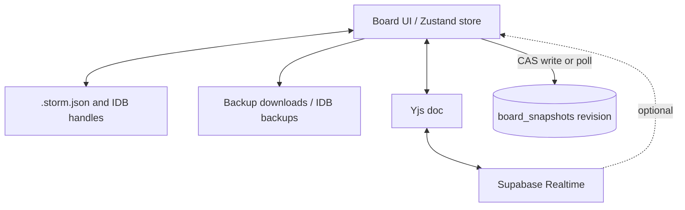

# 8. Cross-cutting Concepts

Evidence sources: [`src/lib/working-file.ts`](../../src/lib/working-file.ts), [`src/lib/board-backup.ts`](../../src/lib/board-backup.ts), [`src/lib/collab/`](../../src/lib/collab/), [`src/components/working-file-sync.tsx`](../../src/components/working-file-sync.tsx), [`supabase/schema.sql`](../../supabase/schema.sql), [`middleware.ts`](../../middleware.ts), [`README.md`](../../README.md) §6.

Related: [context.md](context.md) · [introduction.md](introduction.md) · [entry-point.md](../entry-point.md)

## 8.1 Persistence

### Local-first working file (system of record)

| Concept | Behavior | Evidence |
|---------|----------|----------|
| Primary medium | User-owned `.storm.json` via File System Access where available | `working-file.ts` header comment; README §6 |
| Multi-tab slots | URL `?wf=` (and related params) key IndexedDB handles / mobile copies so tabs can open different files even with the same basename | `working-file.ts`, `working-file-tab-context.ts` |
| IndexedDB | DB `e2-working-file` — handles, mobile working copy, recent-files index; legacy singleton keys migrated on read | `LEGACY_IDB_*` keys |
| Writer exclusivity | Web Locks (`navigator.locks`) — one leader tab writes the attached file | `working-file-writer.ts` |
| Autosave & conflict | Solo: autosave; if disk changed while dirty → conflict dialog (keep local / take disk); no silent overwrite | `working-file-sync.tsx` |
| Format | Snapshot v2 with `views[]`; v1 migrated on open; optional `$schema` | `storm-json.ts`, `public/schemas/` |

### Backups (orthogonal to working file)

| Concept | Behavior | Evidence |
|---------|----------|----------|
| Manual / interval | Timestamped `.storm.json` downloads; interval options 0 / 5 / 10 / 15 / 30 min | `board-backup.ts`, README |
| Local backup store | IndexedDB `e2-board-backups`, recent list capped (~12) | `LOCAL_BACKUP_*` |
| Skip unchanged | Session tracks last backup persist key to avoid duplicate auto-backups | `lastBackupPersistKey` |

### Collaboration persistence (secondary, optional)

| Concept | Behavior | Evidence |
|---------|----------|----------|
| Room + snapshot | Postgres `rooms` + `board_snapshots` (jsonb + optional `yjs_state` bytea) | `schema.sql`, `rooms.ts` |
| TTL | Rooms expire after 14 days (`ROOM_TTL_DAYS`) | `config.ts`, SQL default |
| Optimistic lock (CAS) | Snapshot update only if `revision` matches; conflict returns latest revision — never “fetch latest then overwrite” | `saveCollabSnapshot`, `session.ts` persist path |
| Live path vs durable path | Yjs Broadcast for peers; debounced snapshot write (~700 ms) + poll fallback (~1500 ms) | `config.ts`, `SupabaseYjsProvider`, `session.ts` |
| Parallel local mirror | During collab, working file continues as sync target; create-room requires attached + clean file | `file-guard.ts`, README §6 |
| Leave room | Keep board or restore pre-collab stash | `pre-collab-stash.ts`, README |

## 8.2 Security

Threat model is **workshop-grade**, not enterprise multi-tenant isolation. Evidence of controls and gaps:

### Controls present

| Control | Mechanism | Evidence |
|---------|-----------|----------|
| Publishable / anon key only in client | No service-role key in app; env or user-entered URL+key | `.env.example`, `collab/config.ts` |
| Env over localStorage | Deployed env credentials win; browser-saved keys only for static solo hosting | `getSupabaseConnection()` |
| HTTPS URL check | Local connection save rejects non-`https://` URLs | `saveLocalSupabaseConnection` |
| Anonymous auth | Collab uses `signInAnonymously` before room ops | `collab/supabase.ts` |
| RLS | `rooms` / `board_snapshots` policies for anon+authenticated; non-expired rooms only | `schema.sql` |
| Host token | Random token; SHA-256 hash stored in DB; raw token in `localStorage` | `hashHostToken`, `HOST_TOKEN_STORAGE_KEY` |
| Room code entropy | 6-char alphabet without ambiguous glyphs | `generateRoomCode` |
| Collab enter guards | Confirm when local content / working file at risk; create room only if file attached and clean | `file-guard.ts` |
| No silent clobber | File conflict dialogs; collab CAS + sync-conflict UI | `working-file-sync`, collab dialogs, `session.ts` |
| Single writer | Web Locks for file and collab tab writer | writers under `lib/` |

### Boundaries / residual risk (documented, not invented mitigations)

| Risk | Why it remains |
|------|----------------|
| Anyone with anon key + room code can read/update non-expired room data under RLS | Policies allow insert/select/update for anon on live rooms — secrecy of code + key is the gate |
| Publishable key is public by design | Suitable for Free-tier workshop; operator must not put secrets in Next public env |
| Static Pages: no middleware session refresh | `middleware.ts` comment — cookie refresh only on Node hosting |
| Host token in `localStorage` | XSS in the origin could exfiltrate host capability for that browser profile |
| Board content sensitivity | `.storm.json` and collab snapshots may contain business domain knowledge; E2 does not encrypt at rest beyond OS/file permissions and Supabase project config |

## 8.3 Observability

| Area | Current state | Evidence |
|------|---------------|----------|
| Product telemetry / APM | **Not present** — no Sentry, analytics, or metrics SDK found | Repo search of `src/` |
| Logging | Sparse `console.error` on working-file / backup failures | `working-file.ts`, `board-backup.ts` |
| CI build checks | Workflow verifies `out/index.html`, `.nojekyll`, `sw.js` after static build | `deploy-github-pages.yml` |
| Runtime health (collab) | UI status via provider (`connecting` / `connected` / `disconnected`) and conflict dialogs — user-visible, not ops metrics | `SupabaseYjsProvider`, collab components |
| Service worker | Precache + offline document fallback; `/api/*` network-only | `src/sw.ts` |

**Architecture stance:** observability is a known gap for operators; workshop users get in-app conflict/connection UX instead of a monitoring stack. Any APM choice would be a future decision (see Risks / Decisions when adopted).

## 8.4 UX / consistency concepts (brief)

Cross-cutting behaviors that affect every mode:

- **Modeling mode vs placed elements** — palette filters by mode; foreign types remain visible (dashed) — README
- **Undo/redo** — history stack in board store / lib
- **Appearance** — canvas/sidebar presets persisted inside board JSON — README §7 Darstellung

## Related next chapters

- [Architecture Decisions](decisions.md) — ADR-001…008 (workshop-grade model, keys, host token, CAS, …)
- Risks — beta format, collab residual risks, glossary binding
- Quality Requirements — measurable targets for safe optional collaboration
