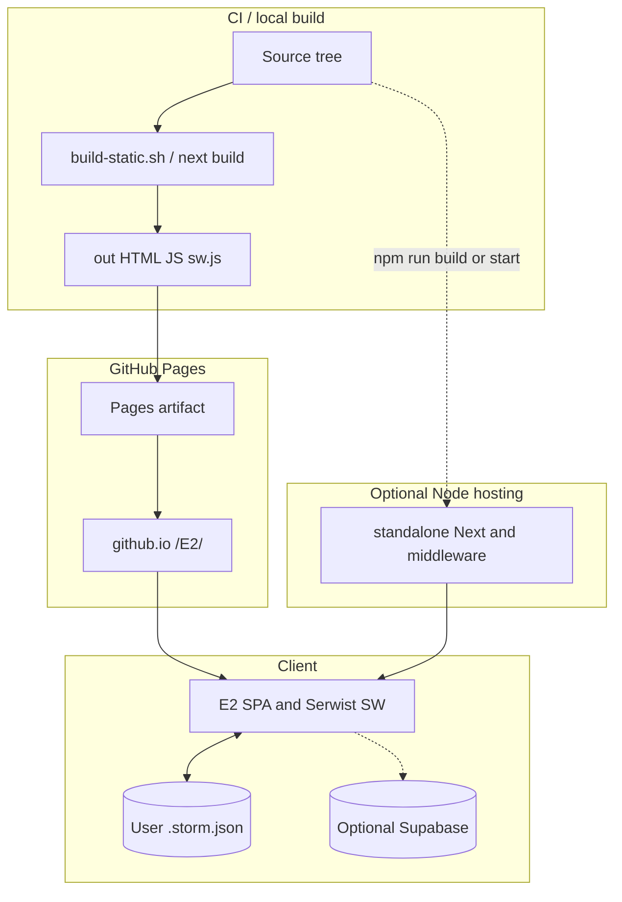

# 7. Deployment View

Evidence sources: [`next.config.ts`](../../next.config.ts), [`scripts/build-static.sh`](../../scripts/build-static.sh), [`.github/workflows/deploy-github-pages.yml`](../../.github/workflows/deploy-github-pages.yml), [`src/sw.ts`](../../src/sw.ts), [`src/app/manifest.ts`](../../src/app/manifest.ts), [`middleware.ts`](../../middleware.ts), [`.env.example`](../../.env.example), [`.github/GITHUB_PAGES_CHECKLIST.md`](../../.github/GITHUB_PAGES_CHECKLIST.md).

Related: [context.md](context.md) · [cross-cutting.md](cross-cutting.md) · [entry-point.md](../entry-point.md)

## 7.1 Deployment overview

E2 ships as a **browser application**. Domain board data is not stored on the app host. Two Next.js output modes share one codebase:

| Mode | Trigger | Output | Typical host |
|------|---------|--------|--------------|
| **Static export** (primary public) | `E2_BUILD_TARGET=static` via `npm run build:static` | `out/` | GitHub Pages project site |
| **Standalone Node** | default `next build` (no static target) | Next `standalone` | Any Node host running `next start` |



## 7.2 Building blocks of infrastructure

| Node | Responsibility |
|------|----------------|
| Developer / CI runner | `npm ci`, static or standalone build |
| GitHub Actions | Build on `main` / `workflow_dispatch`; upload `out/`; deploy-pages |
| GitHub Pages | Serves static files under `https://<owner>.github.io/<repo>/` |
| End-user browser | Runs app, holds working file / IDB, optional collab to Supabase |
| Supabase project (optional) | Not part of Pages deploy; operator configures URL+key (env or UI) |
| Node process (optional) | Serves standalone build; runs middleware for Supabase cookie refresh |

## 7.3 Static export pipeline (GitHub Pages)

### Build

1. Set `E2_BUILD_TARGET=static` and `NEXT_PUBLIC_BASE_PATH` (script default `/E2`; CI uses Actions variable or `/{repository.name}`).
2. `next build` with `output: "export"`, `trailingSlash: true`, `images.unoptimized: true`, `basePath` + `assetPrefix` when basePath set.
3. Ensure `out/.nojekyll` (copied from `public/` or touched) so Pages does not run Jekyll.
4. Serwist emits `public/sw.js` (verified present under `out/sw.js` in CI).

### CI job map

| Job | Steps |
|-----|--------|
| `build` | checkout → Node 22 → `npm ci` → `npm run build:static` with `NEXT_PUBLIC_BASE_PATH` → verify `out/.nojekyll`, `out/index.html`, `out/sw.js` → upload-pages-artifact |
| `deploy` | `actions/deploy-pages@v4` into `github-pages` environment |

Permissions: `contents: read`, `pages: write`, `id-token: write`. Concurrency group `pages`, no cancel-in-progress.

### Operator checklist (from repo)

One-time: Pages source = **GitHub Actions**; confirm workflow green; open `https://<user>.github.io/<repo>/`. Optional repo variable `NEXT_PUBLIC_BASE_PATH` only if path ≠ repo name. See [`.github/GITHUB_PAGES_CHECKLIST.md`](../../.github/GITHUB_PAGES_CHECKLIST.md).

### Local preview

```bash
npm run build:static
npx serve out
# → http://localhost:3000/E2/  (or configured basePath)
```

## 7.4 Standalone Node mode

When `E2_BUILD_TARGET` is not `static`:

- `output: "standalone"`
- Default `basePath` empty unless `NEXT_PUBLIC_BASE_PATH` set
- [`middleware.ts`](../../middleware.ts) runs `updateSession` for Supabase SSR cookie refresh on matched routes (excluded static assets)
- **Does not run on GitHub Pages** — session refresh is a Node-hosting concern only

## 7.5 PWA / offline shell

| Piece | Behavior |
|-------|----------|
| Serwist wrapper | `@serwist/next` in `next.config.ts`; **disabled in development** |
| SW source → dest | `src/sw.ts` → `public/sw.js` |
| Precache | Build manifest + additional entry for `{basePath}/~offline` revised by git HEAD (or UUID) |
| Runtime | Default Serwist cache; `/api/*` → `NetworkOnly` |
| Navigation fallback | Document requests → `~offline` page when offline |
| Web manifest | `src/app/manifest.ts` — name “E2 Event Storming”, `display: "standalone"`, `force-static` |

Offline shell caches the **app UI**, not a substitute for the user’s working file as system of record ([cross-cutting.md](cross-cutting.md)).

## 7.6 Configuration surfaces

| Variable / setting | Effect |
|--------------------|--------|
| `E2_BUILD_TARGET=static` | Static export vs standalone |
| `NEXT_PUBLIC_BASE_PATH` | Asset and route prefix (Pages project path) |
| `NEXT_PUBLIC_SUPABASE_URL` | Optional deploy-wide Supabase URL |
| `NEXT_PUBLIC_SUPABASE_PUBLISHABLE_KEY` (or legacy `ANON_KEY`) | Optional deploy-wide key; else browser localStorage |
| Pages: Source = GitHub Actions | Required for this workflow |

No app server env is required for solo local-file use on static hosting.

## 7.7 Mapping to quality goals

| Goal | Deployment contribution |
|------|-------------------------|
| Deployability | Automated Pages pipeline + verified artifact |
| Offline / PWA | Serwist precache + offline page |
| Data ownership | Host serves code only; boards stay on client / optional Supabase |
| Safe collab | Collab backend is external; static site can still use user-supplied Supabase connection |

## Related next chapters

- Building Block View — code modules behind the deployed SPA (DOC_FOCUS: implementation)
- Constraints — Next/Pages/static-export limits as architecture constraints
- Runtime View — request/sync flows once the SPA is loaded
