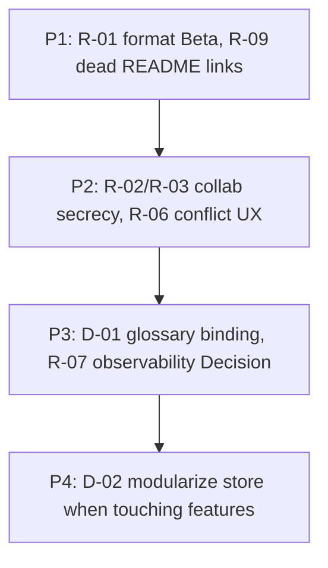

# 11. Risks and Technical Debt

Evidence sources: [`README.md`](../../README.md) (Beta note, method gaps), [constraints.md](constraints.md), [cross-cutting.md](cross-cutting.md), [deployment.md](deployment.md), [building-blocks.md](building-blocks.md), [runtime.md](runtime.md). Claims below are tied to those sources — not speculative threat models without evidence.

Related: [introduction.md](introduction.md) · [solution-strategy.md](solution-strategy.md)

## 11.1 Risks

| ID | Risk | Impact | Likelihood (qualitative) | Mitigation already in product / docs | Residual |
|----|------|--------|--------------------------|--------------------------------------|----------|
| R-01 | **`.storm.json` format change (Beta)** breaks older files or external consumers | Data interchange / reopen fails | Medium — README declares Beta | v1→v2 migration on import; published schemas; version field | Future major bumps may still need new migrators |
| R-02 | **Collab secrecy depends on anon key + room code** | Workshop board readable/writable by anyone with both | Medium in shared/public deployments | RLS on non-expired rooms; room TTL 14d; HTTPS URL check for local keys | Not enterprise isolation; treat as workshop-grade ([cross-cutting](cross-cutting.md) §8.2) |
| R-03 | **Host token / Supabase connection in `localStorage`** | XSS on origin can steal host capability or keys | Low–medium (depends on XSS surface) | No service-role key; env preferred over localStorage | Origin XSS remains out of app crypto scope |
| R-04 | **Browser capability variance** (FS Access, Web Locks, SW) | Degraded save/offline UX on some browsers | Medium | Fallbacks: paste/open, mobile IDB copy, conflict UI | Feature parity not guaranteed everywhere ([constraints](constraints.md) TC1–TC2) |
| R-05 | **Static Pages vs Node middleware gap** | Session cookie refresh absent on Pages; collab auth path differs by host | Medium for cookie-based SSR expectations | Anon sign-in from browser; local connection UI for static | Operators must not assume middleware on Pages |
| R-06 | **Silent data loss if conflict UX ignored / misunderstood** | User keeps wrong side of file or room revision | Low–medium in workshops | Explicit conflict dialogs; CAS; no “fetch latest then overwrite” | Training / facilitator awareness still needed |
| R-07 | **No product observability** | Production issues hard to diagnose for operators | High for ops, low for solo local use | CI artifact checks; in-app collab status | No APM/metrics — accepted gap until a Decision adds one |
| R-08 | **Domain content sensitivity** on disk / in Supabase snapshots | Business knowledge exposure via file share or project misconfig | Context-dependent | Local-first ownership; operator-controlled Supabase | No app-level encryption at rest |
| R-09 | **README links to deleted docs** (`BOARD-JSON-SCHEMA`, `COLLABORATION`, `GITHUB-PAGES`) | Onboarding confusion; broken relative links | Certain until README updated | Content covered by arc42 + `public/schemas` / SQL / workflow | README still points at missing files |

## 11.2 Technical debt / known weaknesses

| ID | Item | Evidence | Suggested direction (not scheduled) |
|----|------|----------|-------------------------------------|
| D-01 | **Glossary not bound to sticky labels** | README: partial / soft gap; “methodisch größte Hebel” | Bind or suggest terms when editing labels |
| D-02 | **Large monolithic store / board shell** | `storm-board-store.ts` / `storm-board.tsx` size ([building-blocks](building-blocks.md)) | Split commands / view models when changing areas |
| D-03 | **Collab complexity** (Yjs + CAS + file mirror + tab locks) | `src/lib/collab/`, [runtime](runtime.md) RT3–RT6 | Keep tests around conflict policy; avoid silent overwrite regressions |
| D-04 | **Soft validation only** for some method rules | README soft-validation notes | Harden selectively per facilitator phase if workshops demand it |
| D-05 | **PWA offline ≠ board SoR** | Serwist caches UI; working file remains SoR | Document clearly in UX/help; avoid implying full offline board without file |
| D-06 | **Generated SW gitignored** | `.gitignore` `public/sw.js` | Always verify `out/sw.js` in CI (already done) |
| D-07 | **Native Miro / paper overlays out of scope** | README ❌ | Stay out unless product decision changes |
| D-08 | **Architecture docs vs product README language split** | DE README, EN arc42 | Keep links; optionally sync README dead links to arc42 |

## 11.3 Priority sketch

## 11.4 Open questions (human)

1. Should README dead links be retargeted to arc42 chapters in a dedicated docs/README PR?
2. Is workshop-grade collab security an explicit product acceptance, or is a tighter model planned?
3. Should observability remain “none” or is a lightweight error reporter desired?

## Related next chapters

- [Architecture Decisions](decisions.md) — accepted security ADRs; open questions above still undecided
- Quality Requirements — measurable targets for goals in [introduction.md](introduction.md) §1.2
- Glossary — product/format terms (`storm.json`, CAS, working file, …)
