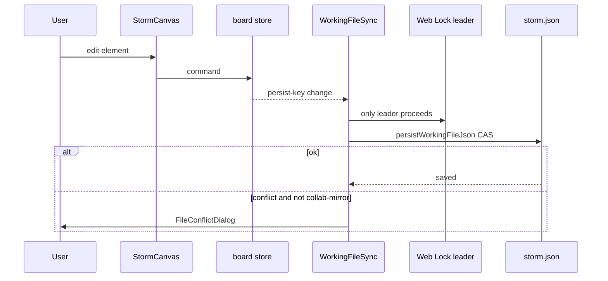
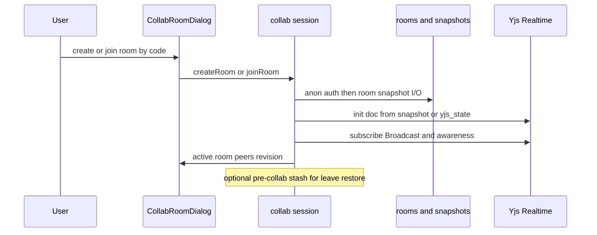
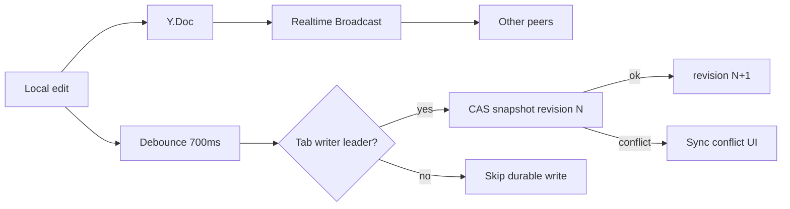

# 6. Runtime View

Evidence sources: [`src/components/working-file-sync.tsx`](../../src/components/working-file-sync.tsx), [`src/lib/working-file.ts`](../../src/lib/working-file.ts), [`src/lib/collab/session.ts`](../../src/lib/collab/session.ts), [`src/lib/collab/rooms.ts`](../../src/lib/collab/rooms.ts), [`src/lib/collab/file-guard.ts`](../../src/lib/collab/file-guard.ts), [`src/components/storm-board.tsx`](../../src/components/storm-board.tsx).

Related: [building-blocks.md](building-blocks.md) · [cross-cutting.md](cross-cutting.md) · [context.md](context.md)

## 6.1 Runtime scenarios overview

| ID | Scenario | When |
|----|----------|------|
| RT1 | Solo edit + autosave | Working file attached; no active room (or collab not driving editor) |
| RT2 | Solo external-file conflict | Disk changed while local editor dirty |
| RT3 | Create / join collab room | Supabase configured; user opens room flow |
| RT4 | Live collab edit + durable snapshot | Room active; tab holds writer lock |
| RT5 | Newer remote / sync conflict | CAS or poll detects newer server while local dirty |
| RT6 | Leave / pagehide flush | User leaves room or tab hides/unloads |

## 6.2 RT1 — Solo edit and autosave

Rules (from `working-file-sync.tsx`):

- Persist only if file attached, not paused, **writer leader**, not mid-conflict.
- On store change: microtask-queued flush when dirty.
- **Focus / visibility (solo):** clean editor + disk changed → silent pull; dirty + disk changed → one conflict dialog.
- **Collab backup mode:** room owns editor — never pull disk into editor; on file conflict, force rewrite mirror (`skipCas`).

## 6.3 RT2 — Solo file conflict resolution

1. Autosave or focus check detects disk ≠ expected (CAS failure / external change).
2. UI opens conflict dialog (keep local vs take disk).
3. Keep-local can skip CAS once for the forced write; take-disk rehydrates store from file.
4. Autosave remains suspended while the dialog is active (`conflictActiveRef`).

## 6.4 RT3 — Enter collaboration

Preconditions (evidence):

- Create room: working file **attached and clean** (`mustSecureBeforeCreateRoom` / `file-guard.ts`).
- Enter with local content or attached file: confirm dialog (`shouldConfirmCollabEnter`).
- Supabase URL+key via env or localStorage (`isCollabConfigured`).

`storm-board.tsx` can also auto-`joinRoom` from URL `room` query when present.

## 6.5 RT4 — Live edit and CAS snapshot

While collab active:

| Path | Behavior |
|------|----------|
| Live peers | Local edits → Yjs → Supabase Realtime Broadcast; remote updates applied with `REMOTE_ORIGIN` |
| Writer lock | Only tab-writer **leader** schedules/persists Postgres snapshots |
| Debounced durable write | `SNAPSHOT_DEBOUNCE_MS` (~700 ms) → `persistSnapshotNow` |
| Preflight | Fetch latest; if server newer than last applied → conflict handling (no overwrite with fetched revision as write base) |
| CAS | `saveCollabSnapshot` updates only where `revision` equals last known; else `{ conflict: true }` |
| Poll fallback | ~1500 ms / realtime channel on snapshot row when Broadcast insufficient |
| Working file | Parallel mirror of editor; force on conflict in backup mode |

## 6.6 RT5 — Newer remote while dirty

From `session.ts`:

- `pullRemoteIfNewer`: if not locally dirty and no pending debounce → **silent** apply remote snapshot/Yjs state.
- If locally dirty (or timer pending) → `handleNewerRemote` → user-facing sync conflict (do not retry blind overwrite with local payload — covered by tests/policy comments).
- Gestures (`gestureActive`) and an already-open sync conflict suppress pulls.

## 6.7 RT6 — Leave and pagehide

| Event | Actions |
|-------|---------|
| `flushCollabSnapshotNow` | Cancel debounce; leader writes snapshot immediately (e.g. before leave) |
| `pagehide` / `beforeunload` | Leader flush snapshot; if working file attached, `persistWorkingFileJson` without force-clobber policy noted in comments |
| Leave dialog | Keep board or restore **pre-collab stash** |

Follower tabs: durable snapshot flush is a no-op (single-writer).

## 6.8 Quality scenarios (links)

| Quality goal | Runtime expression |
|--------------|-------------------|
| Local-first | RT1–RT2 without Supabase |
| No silent clobber | RT2, RT5 conflict UIs; CAS |
| Safe optional collab | RT3 guards + RT4 single writer |
| Offline UI | PWA shell (see [deployment.md](deployment.md)); working file still SoR |

## Related next chapters

- Solution Strategy — why local-first + optional Yjs/Supabase
- Constraints — browser APIs, static hosting limits on middleware
- Risks — residual collab/security and beta format risks
