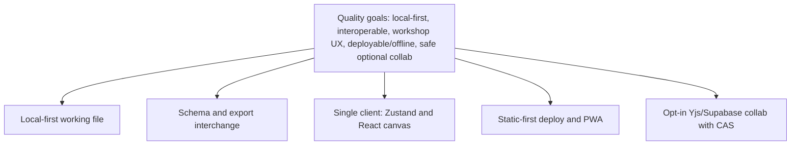

# 4. Solution Strategy

Evidence sources: quality goals in [introduction.md](introduction.md); structure in [building-blocks.md](building-blocks.md); interfaces in [context.md](context.md); persistence/security in [cross-cutting.md](cross-cutting.md); hosting in [deployment.md](deployment.md); flows in [runtime.md](runtime.md); [`README.md`](../../README.md); [`package.json`](../../package.json).

This chapter records **approaches visible in the implemented system** — not aspirational redesigns.

## 4.1 Strategic overview

E2 is a **local-first SPA** for multi-method domain workshops. The board’s system of record is a user-owned `.storm.json` file. Hosting delivers only the application shell (static GitHub Pages by default). **Realtime collaboration is optional** and layered on via Yjs + Supabase when the operator or user supplies a project. Interoperability is achieved through published JSON Schemas and rich client-side exports—not a central board server.

## 4.2 Technology decisions (as implemented)

| Area | Choice | Why it fits (from evidence) |
|------|--------|-----------------------------|
| UI framework | Next.js 15 App Router + React 19 | SPA/PWA with static export **or** standalone Node from one codebase |
| Language | TypeScript | Typed board model and schemas |
| Client state | Zustand (`storm-board-store`) | Single document store driving canvas and I/O |
| Styling | Tailwind CSS | UI chrome without a separate design-system package |
| CRDT / sync | Yjs + `y-protocols` awareness | Live peer sync without owning a custom OT server |
| Collab backend | Supabase (Auth anon, Postgres, Realtime Broadcast) | Free-tier workshop rooms; SQL + RLS in-repo |
| PWA | Serwist | Precache + offline document fallback |
| Tests | Vitest | Unit tests beside `lib/` modules |

Persistence patterns are noted as aligned with [T2](https://github.com/abx-git/T2) (README).

## 4.3 Approaches mapped to quality goals

### Local-first data ownership

- **Approach:** File System Access (where available) + IndexedDB handles / mobile copies; Web Locks for single writer; autosave with explicit conflict UI.
- **Consequence:** Solo workshops need no backend; the host never stores domain boards.
- **Detail:** [cross-cutting.md](cross-cutting.md) §8.1 · [runtime.md](runtime.md) RT1–RT2

### Interoperability

- **Approach:** Canonical snapshot format (`event-storming-tool` v2, multi-view) with JSON Schema under `public/schemas/`; v1 migration on import; many export projections (MD, Mermaid/PlantUML, SVG/PNG, AI context).
- **Consequence:** Handoff and tooling integration without a live E2 session.
- **Detail:** [context.md](context.md) I2 · README Export table

### Workshop usability

- **Approach:** Mode-specific catalogues on one shared board; facilitator phases; undo/redo; mobile sheets; soft validation rather than hard blocks where README marks soft.
- **Consequence:** Method switching does not destroy placed work; facilitation is in-app.
- **Detail:** [introduction.md](introduction.md) R1/R5 · [building-blocks.md](building-blocks.md) UI clusters

### Deployability and offline shell

- **Approach:** Prefer **static export** to GitHub Pages (`basePath`, `.nojekyll`, CI artifact checks); Serwist PWA for UI offline; optional standalone for middleware/session refresh.
- **Consequence:** Cheap public hosting; collab credentials via public env or browser-entered keys on static hosts.
- **Detail:** [deployment.md](deployment.md)

### Safe optional collaboration

- **Approach:** Collab only when Supabase configured; create-room requires secured working file; Yjs for live sync; Postgres snapshot with **revision CAS**; single tab writer; conflict dialogs instead of silent overwrite; room TTL; host token hashed at rest.
- **Consequence:** Workshop sharing without making Supabase mandatory for the product core; residual risks (anon key + room code) accepted at workshop grade — see [cross-cutting.md](cross-cutting.md) §8.2.
- **Detail:** [runtime.md](runtime.md) RT3–RT6

## 4.4 Structural approach

| Principle | Manifestation |
|-----------|----------------|
| Thin app shell | `src/app/page.tsx` → `StormBoard` only |
| UI vs domain libs | Components orchestrate; `src/lib` owns JSON, file, export, geometry, collab |
| One store | Zustand as the in-memory board document |
| Collab as a package | `src/lib/collab/*` isolated; UI dialogs at the edge |
| Dual persistence during collab | Room is editor authority; working file mirrors (backup mode) |

## 4.5 Explicit non-approaches (evidenced by absence / README)

| Not chosen | Evidence |
|------------|----------|
| Server as system of record for solo boards | README: no server for domain data |
| Mandatory accounts for modeling | Anon auth only for collab; solo needs none |
| Native Miro protocol | README out of scope |
| Built-in APM / product analytics | No SDK in `src/` — observability gap documented |
| Encrypting `.storm.json` inside the app | Relies on OS / user file handling and Supabase project config |

## 4.6 Evolution stance

- Board JSON is marked **Beta** in README — format may change; schemas + migration path are the compatibility strategy.
- Deleted standalone docs (`BOARD-JSON-SCHEMA`, `COLLABORATION`, `GITHUB-PAGES`) are superseded by these arc42 chapters + `public/schemas` / SQL / workflow — do not recreate empty stubs.

## Related next chapters

- Constraints — hard limits (static export, browser APIs, public anon key)
- Decisions — ADR-style capture if individual choices need decision records
- Risks — beta format, collab residual risk, glossary binding, observability
